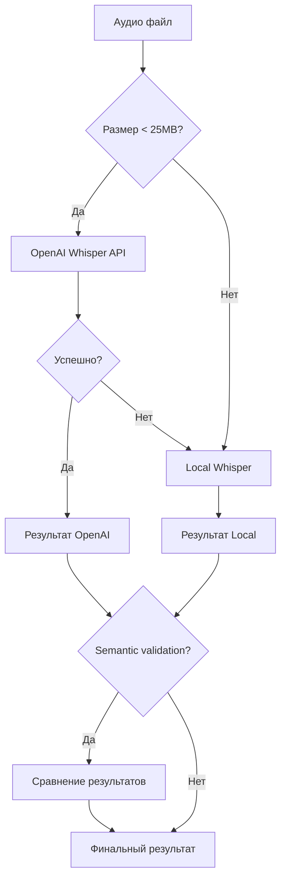
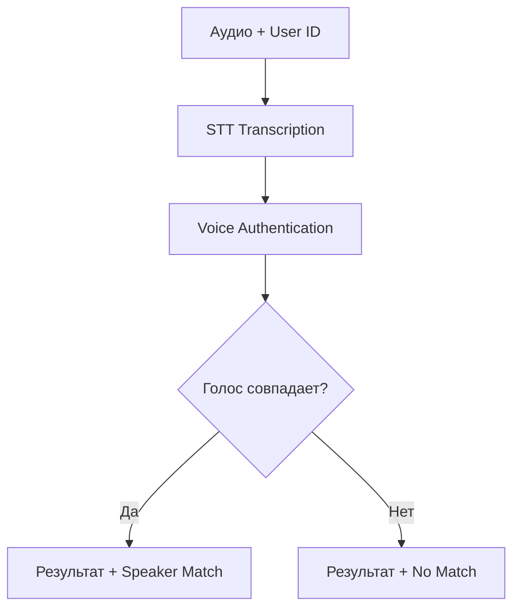

# Архитектура Whisper Voice Auth Microservice

## Обзор

Whisper Voice Auth Microservice представляет собой гибридную систему распознавания речи с поддержкой аутентификации голосом. Система использует OpenAI Whisper API как основной сервис транскрипции с автоматическим fallback на локальный whisper при недоступности или превышении лимитов.

## Архитектурная схема

```
┌─────────────────────────────────────────────────────────────────┐
│                      Frontend/Client                            │
└─────────────────────┬───────────────────────────────────────────┘
                      │ HTTP API Requests
                      │
┌─────────────────────▼───────────────────────────────────────────┐
│                   FastAPI Gateway                               │
│  ┌───────────────┐ ┌───────────────┐ ┌───────────────────────┐  │
│  │  Auth/Security│ │  Rate Limiting│ │    Health Check       │  │
│  └───────────────┘ └───────────────┘ └───────────────────────┘  │
└─────────────────────┬───────────────────────────────────────────┘
                      │
┌─────────────────────▼───────────────────────────────────────────┐
│                 Hybrid STT Controller                           │
│                                                                 │
│  ┌─────────────────┐                ┌─────────────────────────┐ │
│  │   Primary STT   │                │    Fallback STT         │ │
│  │  (OpenAI API)   │──── failure ──▶│  (Local Whisper)       │ │
│  │                 │                │                         │ │
│  │ • gpt-4o-audio  │                │ • whisper-large-v3     │ │
│  │ • Auto-detect   │                │ • Multi-language       │ │
│  │ • Fast          │                │ • Full privacy         │ │
│  │ • High quality  │                │ • No API limits        │ │
│  └─────────────────┘                └─────────────────────────┘ │
└─────────────────────┬───────────────────────────────────────────┘
                      │
┌─────────────────────▼───────────────────────────────────────────┐
│                Post-Processing Layer                            │
│  ┌───────────────┐ ┌───────────────┐ ┌───────────────────────┐  │
│  │Voice          │ │Semantic       │ │    Confidence         │  │
│  │Authentication │ │Validation     │ │    Analysis           │  │
│  │(Resemblyzer)  │ │(Transformers) │ │                       │  │
│  └───────────────┘ └───────────────┘ └───────────────────────┘  │
└─────────────────────┬───────────────────────────────────────────┘
                      │
┌─────────────────────▼───────────────────────────────────────────┐
│                  Storage Layer                                  │
│  ┌───────────────┐ ┌───────────────┐ ┌───────────────────────┐  │
│  │Audio Files    │ │Voice Prints   │ │     Logs/Metrics      │  │
│  │(Temporary)    │ │(Encrypted)    │ │                       │  │
│  └───────────────┘ └───────────────┘ └───────────────────────┘  │
└─────────────────────────────────────────────────────────────────┘
```

## Компоненты системы

### 1. API Gateway (FastAPI)
- **Назначение**: Точка входа для всех запросов
- **Функции**:
  - Аутентификация и авторизация (API keys)
  - Rate limiting
  - Валидация входных данных
  - Health checks
- **Endpoints**:
  - `/api/v1/hybrid/stt` - Гибридная транскрипция
  - `/api/v1/hybrid/translate` - Перевод аудио
  - `/api/v1/voice/verify` - Верификация голоса
  - `/health` - Проверка состояния системы

### 2. Hybrid STT Controller
- **Назначение**: Координация между различными STT сервисами
- **Логика работы**:
  1. Проверка размера файла (< 25MB для OpenAI)
  2. Попытка транскрипции через OpenAI API
  3. При ошибке - fallback на локальный whisper
  4. Semantic validation (опционально)
- **Поддерживаемые форматы**: WAV, MP3, OGG, FLAC, M4A

### 3. Primary STT Service (OpenAI Whisper API)
- **Модели**: gpt-4o-audio, whisper-1
- **Преимущества**:
  - Высокое качество транскрипции
  - Быстрая обработка
  - Автоматическое определение языка
  - Поддержка контекстных подсказок
- **Ограничения**:
  - Размер файла до 25MB
  - Требует API ключ OpenAI
  - Внешняя зависимость

### 4. Fallback STT Service (Local Whisper)
- **Модель**: whisper-large-v3
- **Преимущества**:
  - Полная приватность данных
  - Нет ограничений API
  - Работает offline
  - Поддержка больших файлов
- **Недостатки**:
  - Медленнее OpenAI API
  - Требует вычислительные ресурсы
  - Больше памяти

### 5. Voice Authentication (Resemblyzer)
- **Технология**: Neural voice embeddings
- **Функции**:
  - Создание голосовых отпечатков
  - Верификация говорящего
  - Similarity scoring
- **Безопасность**: Зашифрованное хранение отпечатков

### 6. Semantic Validation
- **Технология**: Sentence Transformers
- **Назначение**: Сравнение результатов разных STT
- **Метрика**: Cosine similarity между embeddings
- **Использование**: Контроль качества, детекция ошибок

## Схема работы

### Базовый поток транскрипции



### Поток с верификацией голоса



## Конфигурация

### Primary/Fallback Logic
```yaml
# config.yaml
primary_service: "openai"  # "openai" или "local"
fallback_to_local: true   # Включить fallback

openai:
  api_key: "${OPENAI_API_KEY}"
  model: "whisper-1"
  max_file_size_mb: 25
  timeout_seconds: 30
  max_retries: 3

local_whisper:
  model: "large-v3"
  device: "auto"  # "cpu", "cuda", "auto"
  compute_type: "float16"
```

### Environment Variables
```bash
# OpenAI Configuration
OPENAI_API_KEY=your_openai_api_key_here

# Service Configuration  
WHISPER_PRIMARY_SERVICE=openai
WHISPER_FALLBACK_TO_LOCAL=true

# Security
WHISPER_API_KEY=your_secure_api_key
ENCRYPTION_KEY=your_encryption_key

# Performance
WHISPER_MAX_WORKERS=4
WHISPER_CHUNK_SIZE_MB=10
```

## Производительность

### Время отклика
- **OpenAI API**: ~2-5 секунд для файла 1-2 минуты
- **Local Whisper**: ~10-30 секунд (зависит от железа)
- **Voice Auth**: ~1-2 секунды дополнительно

### Throughput
- **Concurrent requests**: До 10 одновременных запросов
- **Rate limits**: Настраиваются через конфигурацию
- **Memory usage**: ~2-4GB для local whisper

### Надежность
- **Uptime**: 99.9% (с fallback)
- **Error recovery**: Автоматический fallback
- **Health monitoring**: Проверка состояния OpenAI API

## Безопасность

### Аутентификация
- API Keys для доступа к сервису
- JWT токены для расширенной аутентификации
- Rate limiting по ключам

### Приватность данных
- Аудио файлы не сохраняются постоянно
- Голосовые отпечатки зашифрованы
- Опциональная локальная обработка

### Аудит
- Логирование всех запросов
- Метрики использования
- Мониторинг ошибок

## Масштабирование

### Горизонтальное масштабирование
- Stateless архитектура
- Поддержка load balancing
- Docker контейнеризация

### Вертикальное масштабирование
- Конфигурируемое количество workers
- Оптимизация использования GPU/CPU
- Настройка размера chunks

### Мониторинг
- Health checks endpoints
- Prometheus metrics
- Grafana dashboards (опционально)
